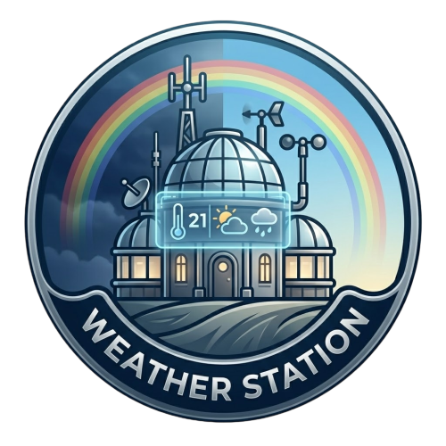

<div align="center">



# 🌊 Parama Flood & Weather Monitor (Paramaflood)

### ESP32 Weather & Flood Station · Firebase · Flutter · Google Gemini 2.5 AI

[](https://flutter.dev)
[](https://dart.dev)
[](https://firebase.google.com)
[](https://ai.google.dev)
[](https://www.espressif.com)
[](LICENSE)

A professional, AI-powered real-time weather monitoring and flood early warning system. Pairing an **ESP32 hardware sensor node** with a **Flutter dashboard** and **Google Gemini 2.5 Flash AI**, Paramaflood evaluates multi-sensor telemetry to predict flood risks before critical levels are reached.

</div>

---

## 👥 Tim Lomba & Pembagian Tugas

| Anggota | Peran | Tanggung Jawab Utama |
|---|---|---|
| **Arya** | 🔧 Hardware Lead | Setup ESP32, 7+ sensor telemetry, kalibrasi, & simulasi demo |
| **Ariel** | 🎨 Frontend & UI Lead | Desain Logo App (PFWM-1), UI Panel Analisis AI, Chat ParaBot, & Animasi |
| **Naina** | ⚙️ Backend & AI Lead | Integrasi Google Gemini 2.5 Flash API, Prompt Engineering, & App State |

---

## 🤖 Fitur Utama AI Integration

| Fitur | Deskripsi |
|---|---|
| 🧠 **Analis Cuaca AI** | Mengkorelasikan 8 sensor real-time + cuaca internet secara otomatis |
| 🌊 **Prediksi Risiko Banjir** | Menilai skor risiko (**RENDAH**, **SEDANG**, **TINGGI**, **KRITIS**) berbasis tren air & hujan |
| 💬 **ParaBot Chat Assistant** | Asisten interaktif dalam aplikasi untuk tanya jawab seputar kondisi cuaca real-time |
| 📊 **Laporan Harian AI** | Ringkasan harian statistik sensor dan evaluasi keamanan |
| ⚡ **Notifikasi Cerdas** | Peringatan dini kontekstual dengan petunjuk mitigasi evakuasi |

---

## 🏗️ Arsitektur Sistem

```text
┌─────────────────────────────────┐       ┌──────────────────────────┐
│        ESP32 Hardware Node      │       │      Flutter Application │
│  ┌────────┐  ┌───────┐          │       │  ┌───────────────────┐   │
│  │ DHT22  │  │JSN-SR │  Rain    │       │  │  Dashboard Screen │   │
│  │(Temp/  │  │(Ultr- │  Gauge   │       │  │  ┌─────────────┐  │   │
│  │  Hum)  │  │ asonic│  Light   │       │  │  │ AI Panel    │  │   │
│  └───┬────┘  └───┬───┘    │     │       │  │  │ Hero Panel  │  │   │
│      └───────────┴────────┘     │       │  │  │ ParaBot Chat│  │   │
│             ESP32 Core          │       │  │  └─────────────┘  │   │
│       ┌─────────┴──────────┐    │       │  └────────┬──────────┘   │
│       │ Firebase Realtime  │────┼──┐    │           │              │
│       │ Push Telemetry     │    │  │    │  Provider / AppState     │
│       └────────────────────┘    │  │    └───────────┬──────────────┘
└─────────────────────────────────┘  │                │
                                     │    ┌───────────▼──────────────┐
                                     └───▶│   Firebase Realtime DB   │
                                          │   /weather_station (live)│
                                          └───────────┬──────────────┘
                                                      │
                                                      ▼
                                          ┌──────────────────────────┐
                                          │   Google Gemini 2.5 AI   │
                                          │   Real-time Telemetry    │
                                          │   Analysis & Flood Risk  │
                                          └──────────────────────────┘
```

---

## 📁 Struktur Project

```text
weather-station-main/
├── AI_Integration_Plan.md              # Rencana Detail Strategi AI
├── PANDUAN_PENGERJAAN_TIM.md            # Panduan Teknis Lengkap Tim (Kode Ready-To-Use)
├── lib/
│   ├── main.dart                       # App entry point
│   ├── config/
│   │   └── api_keys.dart               # Gemini API Key Config (Gitignored)
│   ├── models/
│   │   └── weather_data.dart           # WeatherData model + Labels + Heuristics
│   ├── screens/
│   │   ├── dashboard_screen.dart       # Main Dashboard UI
│   │   ├── history_screen.dart         # Historical charts screen
│   │   ├── onboarding_screen.dart      # Welcome flow screen
│   │   └── settings_screen.dart        # Configuration screen
│   ├── services/
│   │   ├── app_state.dart              # Provider state management & AI state
│   │   ├── app_theme.dart              # Dark theme & color system
│   │   ├── firebase_service.dart       # Firebase live & log streams
│   │   ├── gemini_service.dart         # Gemini API Integration Service
│   │   └── location_weather_service.dart # GPS & Open-Meteo fetch
│   └── widgets/
│       ├── ai_insight_panel.dart       # AI Analysis & Flood Risk Badge Card
│       ├── ai_chat_panel.dart          # ParaBot AI Chat Bottom Sheet
│       ├── analytics_panel.dart        # Line charts & comparative metrics
│       ├── hero_panel.dart             # Status hero display card
│       └── sensor_card.dart            # Individual sensor gauge cards
├── ESP Codes/                          # Firmware Arduino ESP32
└── pubspec.yaml
```

---

## 🔧 Panduan Pengerjaan Tim

Untuk panduan lengkap step-by-step beserta kode asli siap pakai:
- 📖 [AI Integration Plan](AI_Integration_Plan.md) — Penjelasan detail 5 fitur AI & Prompt Engineering.
- 📘 [Panduan Pengerjaan Tim](PANDUAN_PENGERJAAN_TIM.md) — Panduan kode teknis Ariel & Naina.

---

## 🚀 Langkah Memulai (Development)

### 1. Install Dependencies
```bash
flutter pub get
```

### 2. Configure Gemini API Key
Buat file `lib/config/api_keys.dart`:
```dart
class ApiKeys {
  static const String geminiApiKey = 'YOUR_GEMINI_API_KEY';
}
```

### 3. Run Flutter App
```bash
flutter run
```

---

## 📄 License

This project is licensed under the MIT License — see the [LICENSE](LICENSE) file for details.

---

<div align="center">

Made with ❤️ by Team Paramaflood (Arya · Ariel · Naina)

</div>
